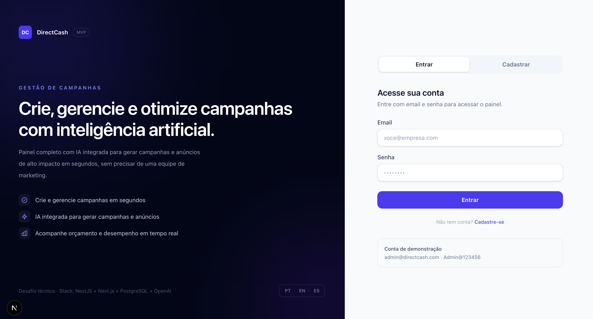

# DirectCash MVP

Aplicacao full-stack para gestao de campanhas e anuncios, com autenticacao JWT, CRUD completo de campanhas e geracao de campanhas com IA.

## Stack Obrigatoria

- Frontend: Next.js (App Router) + TypeScript
- Backend: NestJS + TypeScript
- Banco: PostgreSQL
- ORM: Prisma

## Estrutura do Projeto

```txt
.
├── apps/
│   ├── api/   # NestJS API
│   └── web/   # Next.js App Router
├── docker-compose.yml
├── .env.example
└── README.md
```

## Decisoes Tecnicas e Arquiteturais

1. Monorepo com workspaces (`pnpm`) para manter frontend e backend versionados juntos, com scripts de qualidade padronizados.
2. Backend modular por dominio (`auth`, `campaigns`, `ads`, `ai`) para separar responsabilidades e reduzir acoplamento.
3. Prisma como camada de acesso a dados para tipagem de ponta a ponta e migracoes versionadas.
4. Autenticacao com JWT de acesso + refresh token para equilibrio entre seguranca e usabilidade.
5. DTOs com `class-validator` no backend para validar entradas na fronteira da API.
6. Swagger para documentacao e inspecao rapida dos contratos HTTP em `/api/docs`.
7. Frontend com fluxo simples de autenticacao e area protegida para CRUD, com validacao inline e estados de carregamento, erro, vazio e sucesso.
8. Integracao com OpenAI (`gpt-4o-mini`) para geracao de campanhas a partir de briefs em linguagem natural.
9. Pipeline de qualidade com ESLint + Prettier + Husky + lint-staged + commitlint para manter padrao tecnico consistente.

## Como Rodar

### Modo 1 — Desenvolvimento (com hot reload)

Use este modo durante o desenvolvimento. Alteracoes nos arquivos refletem instantaneamente no browser.

**Pre-requisitos:** Node.js 20+, pnpm 10+, Docker

```bash
cp apps/api/.env.example apps/api/.env

pnpm install

# Sobe apenas o banco
docker compose up -d postgres

# Migracoes, client Prisma e seed
pnpm --filter api prisma migrate deploy
pnpm --filter api prisma generate
pnpm --filter api seed

# Inicia frontend e backend com hot reload
pnpm dev
```

Acessos:

- Frontend: `http://localhost:3100`
- Backend: `http://localhost:3101/api`
- Swagger: `http://localhost:3101/api/docs`

---

## Preview da Tela de Login

<p align="center">
  
</p>
<p align="center">
  <em>Fluxo de autenticação inicial da aplicação.</em>
</p>

### Modo 2 — Docker Compose (build completo)

Use este modo para validar o build final ou testar em ambiente proximo ao de producao. **Nao ha hot reload** — alteracoes exigem rebuild da imagem.

**Pre-requisitos:** Docker + Docker Compose

```bash
cp apps/api/.env.example apps/api/.env
# Edite apps/api/.env e defina OPENAI_API_KEY

# Sobe tudo (postgres + api + web)
docker compose up -d --build
```

Para atualizar apos alteracoes no codigo:

```bash
# Rebuilda e reinicia apenas o servico alterado
docker compose build web && docker compose up -d web
# ou
docker compose build api && docker compose up -d api
```

Acessos:

- Frontend: `http://localhost:3100`
- Backend: `http://localhost:3101/api`
- Swagger: `http://localhost:3101/api/docs`

## Qualidade de Codigo

### Lint

```bash
pnpm lint
```

### Build

```bash
pnpm build
```

### Testes

```bash
pnpm test
```

## Deploy

### Railway (sugerido pelo desafio)

- Criar servicos para `api`, `web` e `postgres`
- Configurar variaveis de ambiente conforme `.env.example`
- Garantir que backend exponha `/api/docs`

## Variaveis de Ambiente

Use o arquivo [`.env.example`](./.env.example) como referencia.

## Dependencias Principais

As dependencias detalhadas ficam nos `package.json` de cada app. Abaixo estao apenas os blocos principais da stack:

### Workspace (root)

- `concurrently`: executa API e Web em paralelo no desenvolvimento.
- `husky` + `lint-staged`: aplica validacoes em pre-commit.
- `@commitlint/*`: valida o padrao de mensagens de commit.

### API (`apps/api`)

- Runtime: `@nestjs/*`, `@prisma/client`, `openai`, `passport-jwt`, `bcrypt`.
- Qualidade e build: `typescript`, `eslint`, `jest`, `prettier`, `prisma`.

### Web (`apps/web`)

- Runtime: `next`, `react`, `next-intl`, `next-themes`.
- Qualidade e build: `typescript`, `eslint`, `tailwindcss`.

## Workflow de Commits

- Hook `pre-commit`: executa `lint-staged`.
- Hook `commit-msg`: executa `commitlint`.
- Convencao: `type(scope): subject`
  - Exemplo: `feat(api): add campaigns pagination`

## Checklist de Entrega do Desafio

- [x] Stack obrigatoria em monorepo
- [x] Auth JWT (registro/login/refresh/logout/me)
- [x] CRUD completo de entidade principal
- [x] Swagger em `/api/docs`
- [x] Lint/format/hooks configurados
- [x] README com setup, arquitetura e dependencias justificadas
- [x] Seed de dados (`pnpm --filter api seed`)
- [x] Integracao com IA (OpenAI — gerar campanha e anuncios)
- [x] Validacao inline no frontend (formulario de campanha e autenticacao)
- [ ] Deploy publico (preencher apos publicacao)

## Licenca

Uso apenas para avaliacao tecnica.
